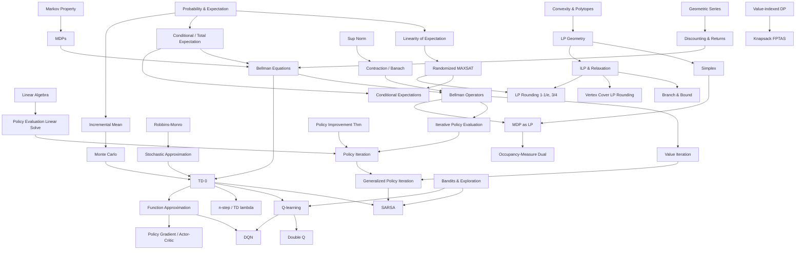

# Concept map

Arrows point from prerequisite to dependent concept.

```mermaid
graph TD
  P[Probability & Expectation] --> LE[Linearity of Expectation]
  P --> CE[Conditional / Total Expectation]
  P --> IM[Incremental Mean]
  GS[Geometric Series] --> DISC[Discounting & Returns]
  NORM[Sup Norm] --> CON[Contraction / Banach]
  LA[Linear Algebra] --> PE[Policy Evaluation Linear Solve]
  CVX[Convexity & Polytopes] --> LPG[LP Geometry]
  RM[Robbins-Monro] --> SA[Stochastic Approximation]
  MP[Markov Property] --> MDP[MDPs]
  DISC --> BE[Bellman Equations]
  CE --> BE
  MDP --> BE
  BE --> OPS[Bellman Operators]
  CON --> OPS
  OPS --> VI[Value Iteration]
  OPS --> PEV[Iterative Policy Evaluation]
  PE --> PI[Policy Iteration]
  PEV --> PI
  PIT[Policy Improvement Thm] --> PI
  PI --> GPI[Generalized Policy Iteration]
  VI --> GPI
  IM --> MC[Monte Carlo]
  SA --> TD[TD 0]
  BE --> TD
  MC --> TD
  TD --> SARSA
  TD --> QL[Q-learning]
  QL --> DQ[Double Q]
  QL --> DQN
  GPI --> SARSA
  EXP[Bandits & Exploration] --> SARSA
  EXP --> QL
  TD --> TDL[n-step / TD lambda]
  TD --> FA[Function Approximation]
  FA --> DQN
  FA --> PG[Policy Gradient / Actor-Critic]
  LPG --> SIM[Simplex]
  LPG --> ILP[ILP & Relaxation]
  OPS --> MDPLP[MDP as LP]
  SIM --> MDPLP
  MDPLP --> DUAL[Occupancy-Measure Dual]
  ILP --> BB[Branch & Bound]
  ILP --> VC[Vertex Cover LP Rounding]
  LE --> MAXSAT[Randomized MAXSAT]
  CE --> DERAND[Conditional Expectations]
  MAXSAT --> DERAND
  ILP --> LPR[LP Rounding 1-1/e, 3/4]
  MAXSAT --> LPR
  DPK[Value-indexed DP] --> FPTAS[Knapsack FPTAS]
```
